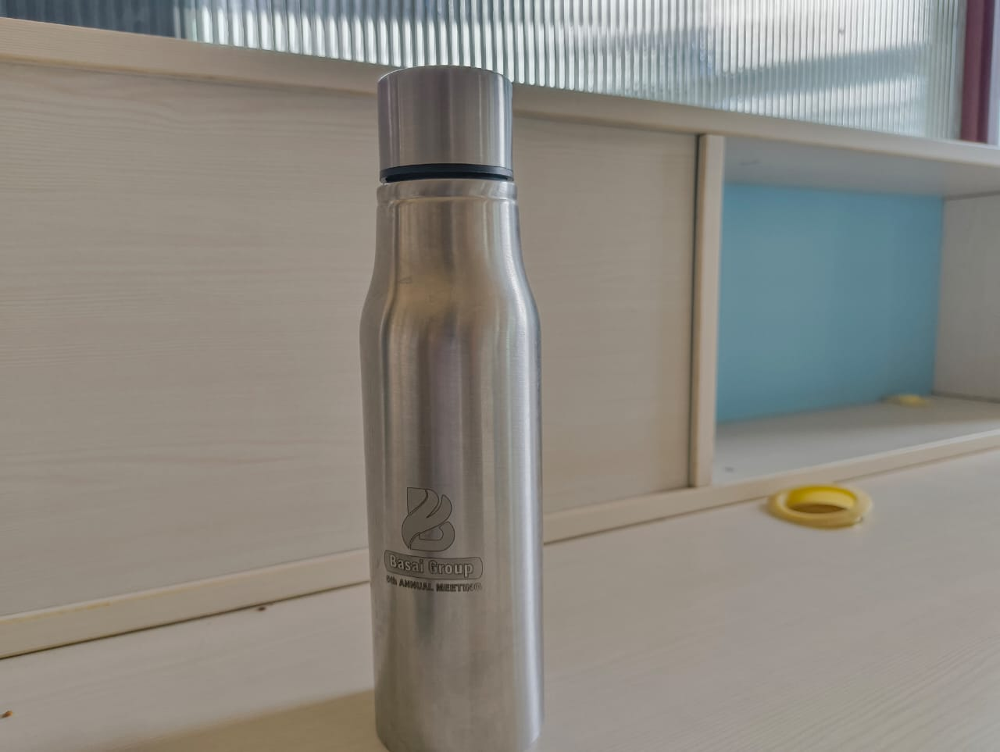
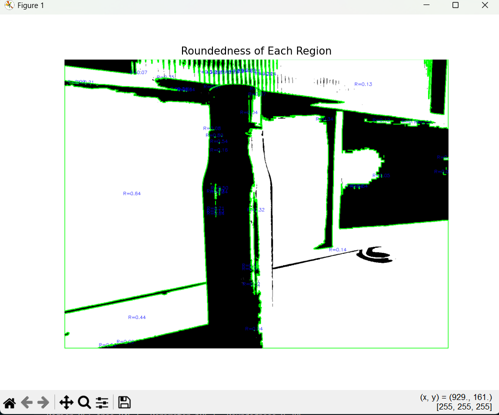

# Measure Roundedness in Binary Images

This script calculates the *roundedness* of objects in a binary image using OpenCV. It’s useful for shape analysis, classification, and identifying how closely a region resembles a perfect circle.

---

### What is Roundedness?

Roundedness is a dimensionless metric that quantifies how circular a shape is. It’s defined as:

```
Roundedness = (4 × π × Area) / (Perimeter²)
```

Where:

- **Area** is the number of pixels inside the contour.
- **Perimeter** is the arc length around the shape’s boundary.

A perfect circle has a roundedness of **1.0**. Irregular or elongated shapes have lower values, approaching 0.

---

## Techniques Used

- **Contour Detection** using [`cv2.findContours`](https://docs.opencv.org/4.x/d9/d8b/tutorial_py_contours_hierarchy.html): Identifies the outer boundaries of shapes in a binary image.
- **Area and Perimeter Calculation**:
  - [`cv2.contourArea`](https://docs.opencv.org/4.x/d1/d32/tutorial_py_contour_properties.html) for computing the area.
  - [`cv2.arcLength`](https://docs.opencv.org/4.x/d1/d32/tutorial_py_contour_properties.html) for calculating the perimeter.
- **Shape Metric**: Applies the standard roundedness formula to each detected region.

---

## Example

<div style="display: flex; gap: 20px;">
  <div>
    <strong>Input Image</strong><br>
    
  </div>
  <div>
    <strong>Output with Roundedness</strong><br>
    
  </div>
</div>

---

Each region’s area, perimeter, and roundedness value are printed in the console. This output helps you identify circular objects or evaluate the regularity of shapes in an image.
