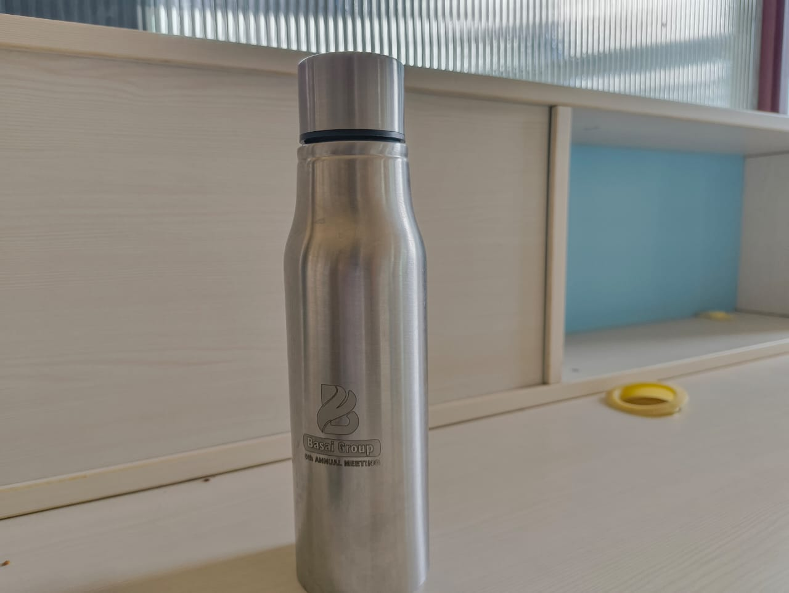
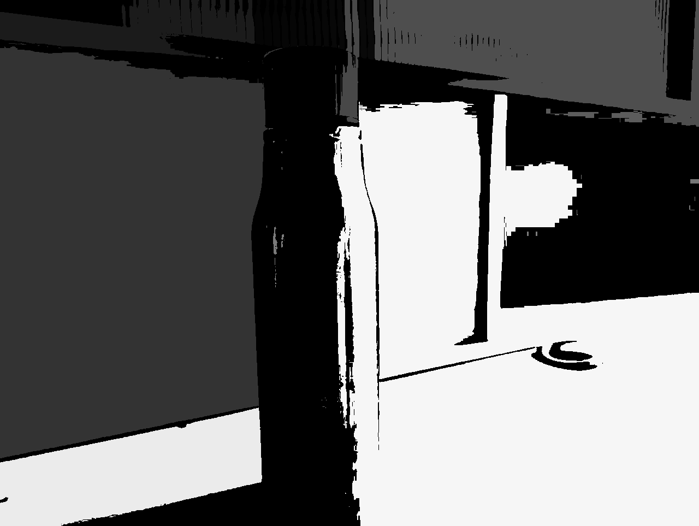

# Sequential Labeling Algorithm in Binary Images

This script implements a two-pass **sequential labeling** algorithm to assign unique labels to connected regions in a binary image. It is a core technique in connected component analysis, often used in image segmentation, OCR, and object counting.

---

### What is Sequential Labeling?

Sequential labeling (also called connected-component labeling) assigns a unique integer to each group of connected foreground pixels (usually 255 in a binary image). The algorithm proceeds in two main passes:

1. **First Pass**:
   - Assign temporary labels to pixels.
   - Track equivalences between connected neighbors.
2. **Second Pass**:
   - Resolve equivalence chains and update all labels to their root representatives.

---

## Techniques Used

- **Two-Pass Algorithm**: Implements the classic labeling method with a union-find-like structure for equivalence resolution.
- **Neighbor Check**: Considers 4-connected neighbors (top and left) for initial labeling.
- **Label Equivalence Resolution**: Uses a simplified union-find approach to resolve multiple labels into a single root label.

---

## Example

  

    <strong>Input Image</strong> 
    
  

  

    <strong>Labeling Output</strong> 
    
  

---

Each connected region is assigned a unique label and rendered as a grayscale value. The result can be used for further analysis like shape description, counting, or filtering specific components.
